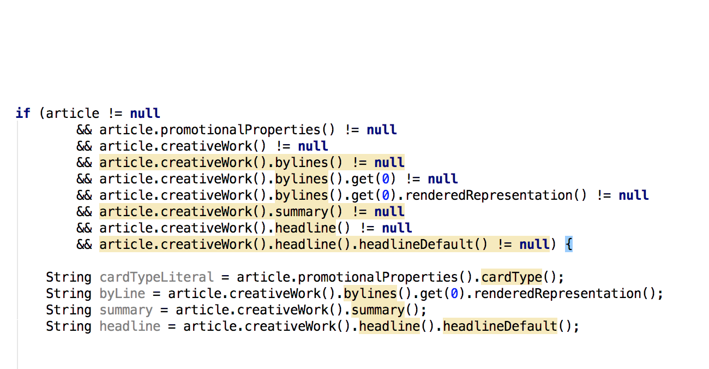
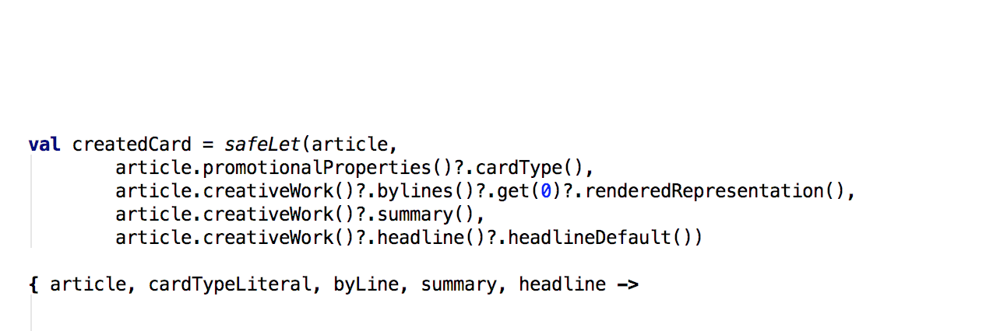
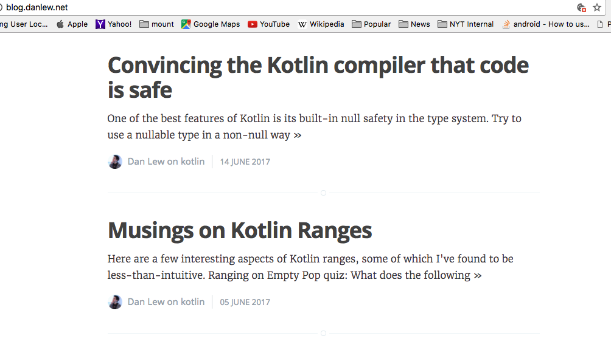
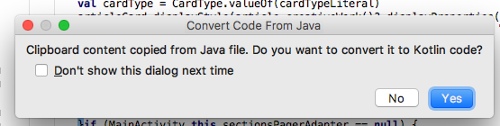
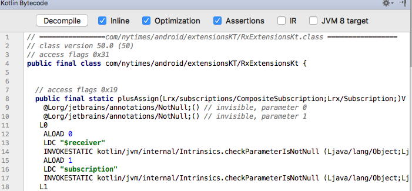
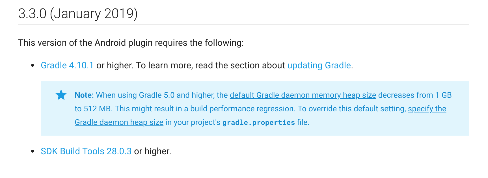

# [fit]Selling Kotlin 
# [fit] to Management
## Yes we can!
---
#I did say managers, and you probably came here for that
---
#[fit] I lied
---
#[fit] It's truly about the stakeholders
---


---


---
# It's truly about the stakeholders
- You 

---
# It's truly about the stakeholders
- You
- Colleagues

---
# It's truly about the stakeholders
- You
- Colleagues
- Management and business

---
#You??? Maybe you aren't truly convinced
---
#[fit] Why is Kotlin 
#[fit] right for me?

---
#[fit] It's official
---
#[fit] Null safety
---
#[fit] Immutability
---
#[fit] Code size reduction
---
#I still was not convinced 
---
#Groovy Broke My :heart:
---
#Kotlin looked weird.
---
#We started using GraphQL, everything was nullable
---
#[fit]I had no desire
#[fit]for crazy nested if statements.

---


---

#[fit]**Kotlin saved me**

---


---
##There's fun stuff too!
```java 
val disposable = programStore.get(key)
compositeDisposable += disposable
```
###Using extensions!

```java
operator fun CompositeDisposable.plusAssign(disposable: Disposable) {
    this.add(disposable)
}
```

---
#That's my story, on to convincing colleagues
---
#Maybe teammates are nervous or don't have the time to learn something new
---
#It's all about discussion and dialogue
---
[.build-lists: true]
#what you can do
- Try sending out daily resources (articles on operators, tips, and best practices)
- Examples of Kotlin conversions
- Plan for in office working sessions to demonstrate or dev arch meetings (kotlin koans)

---
[.build-lists: true]
#talking points
- Best strategy by far for me has been discussion of what people think won't
work; they usually bring up
- Don't want to switch entirely to Kotlin (counter with interop)
- Is there that much of a point (counter with shorter code/nullability)
- support, libraries, tooling (counter with all these work)

---
#Official Google samples are now written in Kotlin 
#Conference slides in Kotlin
---
#Follow your leaders!
##Android luminaries are writing articles and code in kotlin today


---
#[fit]On to convincing the suits!
---
# **Officially supported by Google**
## What does this mean?, 
##tooling works, bugs directly to Google
---
#[fit] Jetbrains support 
---
# Copy paste in editor


---
#[fit]Disassemble and examine bytecode


---

### Proper test support
```java

    @Test
    fun getConstraintSet() {
        CardConstraint.values().forEach {
            val card = mock(ArticleCard::class.java)
            Mockito.`when`(card.cardType()).thenReturn(it.cardType)
            Mockito.`when`(card.rendition()).thenReturn(it.rendition)

            if (it.columnCount > 0) {
                assertMatching(card, it, it.columnCount)
            } else {
                for (columnCount in 1..4) {
                    assertMatching(card, it, columnCount)
                }
            }
        }
    }
```
---
### Works with Data Binding!
```java
 override fun bind(binding: CardArticleBinding, position: Int) {
        ConstraintSet().apply {
            load(binding.root.context, constraintSetLayoutRes)
            applyTo(binding.root as ConstraintLayout)
        }

        binding.root.post { binding.card = card }
    }
```

---

### Latest Android and Gradle tools, incremental and instant compilation


---
#Lastly, 
##It just works with everything; Picasso, RxJava, Guava, Dagger etc....

---
##Managers don't care about any of that they care about
## ROI (return on investment)
---
[.build-lists: true]
# ROI 
- Reduced issues overall (type safety forces safer code)
- Reduced time spent fixing production issues (less bugs, see above)
- Reduced time on boilerplate code (less code to write)
- Reduced code review time (less code to review)

---
#Leads to:
##Increased feature development & 

##Happier Developers


---
##**Kotlin != Golden Hammer**
##Good managers want to know the bad as well
---
[.build-lists: true]
# The cons
- Limited static analyzers
- Minor increase in build time
- Mockito needs some tweaking (when, open keyword)

---
[.build-lists: true]
#How to get your feet wet low risk
- Unit tests, not in source (we wrote kotlin tests that called java classes)
- Annotation processor rework or impl (apollo uses kotlin to generate java for graphql)
- Put behind interfaces to hide implementation 
- Know that mistakes will be made as everyone learns it 

---
#Links and resources

###Kotlin weekly (www.kotlinweekly.net)
###Kotlin koans (kotlinlang.org/docs/tutorials/koans.html)
###Kotlin by Example (hadihariri.com/2017/06/12/kotlin-by-example)
###Intro to Kotlin Google IO 2017 (youtube.com/watch?v=X1RVYt2QKQE)